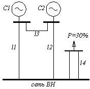
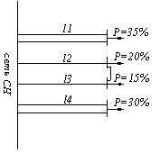
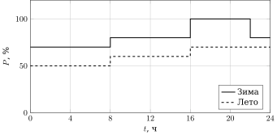
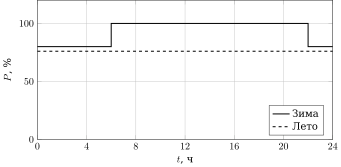
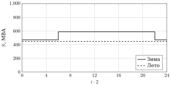
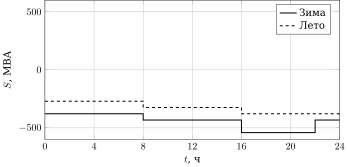
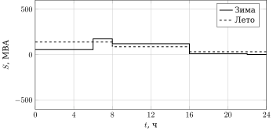
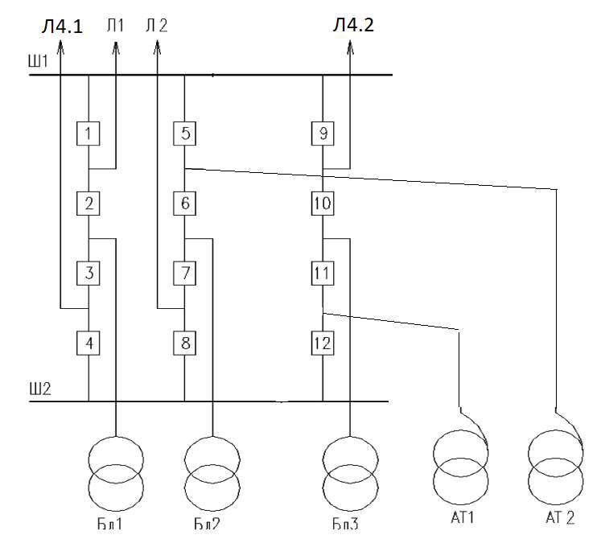

<style>
.wy-nav-content { max-width: 900px; }
.wy-table-responsive { text-align: center; }
.wy-table-responsive > table,
.rst-content table { display: inline-table !important; width: auto !important; margin: 1em auto !important; }
table th, table td { text-align: center; }
.rst-content img { display: block; margin: 1.5em auto 0.5em; max-width: 100%; height: auto; }
.rst-content p > em:only-child { display: block; text-align: center; margin-top: 0; }
.rst-content div.arithmatex { overflow-x: auto; overflow-y: hidden; }
</style>

<script>
window.MathJax = {
  tex: {
    inlineMath: [["\\(", "\\)"]],
    displayMath: [["\\[", "\\]"]],
    processEscapes: true,
    processEnvironments: true
  },
  options: {
    ignoreHtmlClass: ".*|",
    processHtmlClass: "arithmatex"
  }
};
</script>
<script src="js/tex-mml-svg.js" id="MathJax-script"></script>

# Проектирование электрической части КЭС

```python exec="on" session="model"
from decimal import ROUND_HALF_UP, Decimal

# генератор
p_nom_g = 500                   # номинальная мощность, МВт
u_nom_g = 20                    # номинальное напряжение, кВ
cosf_g = 0.85                   # коэффициент мощности
xd2_g = 0.242                   # сверхпереходное сопротивление, о.е.
r_g = 0.00114                   # активное сопротивление, Ом
n_g = 4                         # количество

# собственные нужды
pmax_pust = 7                   # нагрузка пуска, %
u_nom_sn = 6                    # номинальное напряжение, кВ
cosf_sn = 0.85                  # коэффициент мощности

# РУВН
u_nom_ruvn = 500                # номинальное напряжение, кВ
s_nom_s1 = 7000                 # мощность системы С1, МВА
x_s1 = 1.3                      # сопротивление системы С1, о.е.
p_avrez_s1 = 600                # аварийный резерв С1, МВт
s_nom_s2 = 8500                 # мощность системы С2, МВА
x_s2 = 0.9                      # сопротивление системы С2, о.е.
p_avrez_s2 = 810                # аварийный резерв С2, МВт
l_ruvn = [500, 800, 600, 700]   # длины линий, км

# РУСН
u_nom_rusn = 220                # номинальное напряжение, кВ
p_ng_rusn = 460                 # нагрузка, МВт
cosf_ng_rusn = 0.85             # коэффициент мощности
l_rusn = [500, 800, 600, 700]   # длины линий, км

# графики
d_zim = 215                     # зимних дней
d_let = 150                     # летних дней
load_rusn_zim = [70, 70, 70, 70, 80, 80, 80, 80, 100, 100, 100, 80]
load_rusn_let = [50, 50, 50, 50, 60, 60, 60, 60, 70, 70, 70, 70]
load_gen_zim = [80, 80, 80, 100, 100, 100, 100, 100, 100, 100, 100, 80]
load_gen_let = [76] * 12

# схемы
k_per = 1                       # коэффициент перегрузки
n_ts = 2                        # число трансформаторов связи
n_g_rusn_var1 = 0               # генераторов на РУСН, вар. 1
n_g_rusn_var2 = 1               # генераторов на РУСН, вар. 2

# капиталовложения
k_bt_500 = 585                  # блочный трансформатор 500 кВ, тыс. у.е.
k_bt_220 = 450                  # блочный трансформатор 220 кВ, тыс. у.е.
k_at_var1 = 600                 # автотрансформатор вар. 1, тыс. у.е.
k_at_unit = 292                 # однофазный автотрансформатор, тыс. у.е.
k_q_500 = 170                   # ячейка 500 кВ, тыс. у.е.
k_q_220 = 100                   # ячейка 220 кВ, тыс. у.е.

# издержки
ko_220 = 2.9                    # обслуживание, %
ka_220 = 2                      # амортизация, %

# потери
phh_bt_500 = 420                # потери х.х. блочного 500 кВ, кВт
phh_bt_220 = 345                # потери х.х. блочного 220 кВ, кВт
phh_at_var1 = 220               # потери х.х. АТ вар. 1, кВт
phh_at_unit = 125               # потери х.х. однофазного, кВт
pkz_bt_500 = 1210               # потери к.з. блочного 500 кВ, кВт
pkz_bt_220 = 1300               # потери к.з. блочного 220 кВ, кВт
pkz_at_var1 = 1050              # потери к.з. АТ вар. 1, кВт
pkz_at_unit = 470               # потери к.з. однофазного, кВт
s_nom_bt_500 = 630              # мощность блочного 500 кВ, МВА

# удельные стоимости потерь
u_xx = 0.45e-2 * 1e-3           # удельные потери х.х., тыс. у.е./(кВт*ч)
u_kz = 1.8e-2 * 1e-3            # удельные потери к.з., тыс. у.е./(кВт*ч)

# ущерб
y_0 = 0.06e-3                   # удельный ущерб, тыс. у.е./(кВт*ч)
t_vt_500 = 220                  # время восстановления трансформатора, ч
w_t_500 = 0.05                  # поток отказов трансформатора, 1/год
t_vt_220 = 60                   # время восстановления трансформатора, ч
w_t_220 = 0.025                 # поток отказов трансформатора, 1/год
t_vv_220 = 55                   # время восстановления выключателя, ч
w_v_220 = 0.02                  # поток отказов выключателя, 1/год
t_vv_500 = 60                   # время восстановления выключателя, ч
w_v_500 = 0.15                  # поток отказов выключателя, 1/год

# норматив
e_n = 0.12                      # норматив эффективности

# число с запятой
def dec(value, digits=None, sig=None):
	d = Decimal(str(value))
	if digits is not None:
		d = d.quantize(Decimal(1).scaleb(-digits), rounding=ROUND_HALF_UP)
	elif sig is not None and d != 0:
		d = d.quantize(Decimal(1).scaleb(d.adjusted() - sig + 1), rounding=ROUND_HALF_UP)
	text = format(d, "f")
	if "." in text:
		text = text.rstrip("0").rstrip(".")
	return text.replace(".", "{,}")


# столбик чисел
def col(values):
	return r" \\ ".join(str(v) for v in values)


# 3 значащие цифры
def sf(value, n=3):
	d = Decimal(str(value))
	if d == 0:
		return "0"
	exp = d.adjusted()
	q = d.quantize(Decimal(1).scaleb(exp - n + 1), rounding=ROUND_HALF_UP)
	text = format(q, "f")
	if "." in text:
		text = text.rstrip("0").rstrip(".")
	return text.replace(".", "{,}")


# научная запись
def sci(value, n=3):
	d = Decimal(str(value))
	if d == 0:
		return "0"
	exp = d.adjusted()
	m = d.scaleb(-exp).quantize(Decimal(1).scaleb(-(n - 1)), rounding=ROUND_HALF_UP)
	return format(m, "f").replace(".", "{,}") + r"\cdot10^{%d}" % exp


p_two_gen = p_nom_g * 2
snb_tb_norm = (p_nom_g - p_nom_g * pmax_pust / 100) / (cosf_g * k_per)
snb_tb_rem = p_nom_g / (cosf_g * k_per)
snb_tb_max = max(snb_tb_norm, snb_tb_rem)
ssn = p_nom_g * pmax_pust / 100
p_per_ts = [p_ng_rusn - n * p_nom_g for n in range(4)]

# нагрузки
s_ng_rusn_zim = [p * p_ng_rusn / (100 * cosf_ng_rusn) for p in load_rusn_zim]
s_ng_rusn_let = [p * p_ng_rusn / (100 * cosf_ng_rusn) for p in load_rusn_let]
s_ng_g_zim = [p * p_nom_g / (100 * cosf_g) for p in load_gen_zim]
s_ng_g_let = [p * p_nom_g / (100 * cosf_g) for p in load_gen_let]

# перетоки
s_per_ts_zim_var1 = [n_g_rusn_var1 * (a - ssn) - b for a, b in zip(s_ng_g_zim, s_ng_rusn_zim)]
s_per_ts_let_var1 = [n_g_rusn_var1 * (a - ssn) - b for a, b in zip(s_ng_g_let, s_ng_rusn_let)]
s_per_ts_zim_var2 = [n_g_rusn_var2 * (a - ssn) - b for a, b in zip(s_ng_g_zim, s_ng_rusn_zim)]
s_per_ts_let_var2 = [n_g_rusn_var2 * (a - ssn) - b for a, b in zip(s_ng_g_let, s_ng_rusn_let)]

# автотрансформаторы
snb = abs(s_per_ts_zim_var1[10])
snb_nt = snb / n_ts
snom_at_var1 = 400
h_stroke = 16
s_one = (sum(v ** 2 * 2 for v in s_per_ts_zim_var1[:4]) / 8) ** 0.5
s_two = (sum(v ** 2 * 2 for v in s_per_ts_zim_var1[4:]) / h_stroke) ** 0.5
k_one = s_one / snom_at_var1
k_two_stroke = s_two / snom_at_var1
k_max = snb / snom_at_var1
k_two = k_max * 0.9
h_coef = k_two_stroke ** 2 * h_stroke / (0.9 * k_max) ** 2
k_dop_sist_per = 1.23
k_dop_av_per = 1.5

# капиталовложения
k_at_var2 = 3 * k_at_unit
k_var1 = 4 * k_bt_500 + 6 * k_q_500 + 2 * k_at_var1 + 2 * k_q_220
k_var2 = 3 * k_bt_500 + 5 * k_q_500 + 2 * k_at_var2 + 1 * k_bt_220 + 3 * k_q_220

# издержки
i_o_a_var1 = k_var1 * (ko_220 + ka_220) / 100
i_o_a_var2 = k_var2 * (ko_220 + ka_220) / 100

# потери
g_p_ng_g_zim = [p * p_nom_g / 100 for p in load_gen_zim]
g_p_ng_g_let = [p * p_nom_g / 100 for p in load_gen_let]
tnb = (sum(v * 2 for v in g_p_ng_g_zim) * d_zim + sum(v * 2 for v in g_p_ng_g_let) * d_let) / p_nom_g
tau = tnb / 3 + 2 * tnb ** 2 / (3 * 8760)
phh_at_var2 = 3 * phh_at_unit
pkz_at_var2 = 3 * pkz_at_unit
whh_var1 = 4 * phh_bt_500 * tnb + 2 * phh_at_var1 * 8760
whh_var2 = 3 * phh_bt_500 * tnb + 1 * phh_bt_220 * tnb + 2 * phh_at_var2 * 8760
wkz_bt_500_var1 = (sum((v / s_nom_bt_500) ** 2 * 2 for v in s_ng_g_zim) * d_zim
	+ sum((v / s_nom_bt_500) ** 2 * 2 for v in s_ng_g_let) * d_let) * 4 * pkz_bt_500
wkz_bt_220_var1 = 0
wkz_at_var1 = (sum((v / 800) ** 2 * 2 for v in s_per_ts_zim_var1) * d_zim
	+ sum((v / 800) ** 2 * 2 for v in s_per_ts_let_var1) * d_let) * pkz_at_var1 / 2
wkz_var1 = wkz_bt_500_var1 + wkz_bt_220_var1 + wkz_at_var1
wkz_bt_500_var2 = (sum((v / s_nom_bt_500) ** 2 * 2 for v in s_ng_g_zim) * d_zim
	+ sum((v / s_nom_bt_500) ** 2 * 2 for v in s_ng_g_let) * d_let) * 3 * pkz_bt_500
wkz_bt_220_var2 = (sum((v / s_nom_bt_500) ** 2 * 2 for v in s_ng_g_zim) * d_zim
	+ sum((v / s_nom_bt_500) ** 2 * 2 for v in s_ng_g_let) * d_let) * 1 * pkz_bt_220
wkz_at_var2 = (sum((v / 800) ** 2 * 2 for v in s_per_ts_zim_var2) * d_zim
	+ sum((v / 800) ** 2 * 2 for v in s_per_ts_let_var2) * d_let) * pkz_at_var2 / 2
wkz_var2 = wkz_bt_500_var2 + wkz_bt_220_var2 + wkz_at_var2

# издержки на потери
i_p_var1 = whh_var1 * u_xx + wkz_var1 * u_kz
i_p_var2 = whh_var2 * u_xx + wkz_var2 * u_kz

# ущерб
mu_var1 = y_0 * (n_g - n_g_rusn_var1) * p_nom_g * 1e3 * (tnb / 8760) * (w_t_500 * t_vt_500 + w_v_500 * t_vv_500)
mu_var2_500 = y_0 * (n_g - n_g_rusn_var2) * p_nom_g * 1e3 * (tnb / 8760) * (w_t_500 * t_vt_500 + w_v_500 * t_vv_500)
mu_var2_220 = y_0 * n_g_rusn_var2 * p_nom_g * 1e3 * (tnb / 8760) * (w_t_220 * t_vt_220 + w_v_220 * t_vv_220)
mu_var2 = mu_var2_500 + mu_var2_220

# затраты
z_var1 = e_n * k_var1 + i_o_a_var1 + i_p_var1 + mu_var1
z_var2 = e_n * k_var2 + i_o_a_var2 + i_p_var2 + mu_var2

TEX = {
	"PnomG": str(p_nom_g),
	"UnomG": str(u_nom_g),
	"CosfG": dec(cosf_g, 2),
	"XdG": dec(xd2_g, 3),
	"RG": dec(r_g, 5),
	"Ng": str(n_g),
	"PmaxPust": str(pmax_pust),
	"UnomSN": str(u_nom_sn),
	"CosfSN": dec(cosf_sn, 2),
	"UnomRUVN": str(u_nom_ruvn),
	"SnomSOne": str(s_nom_s1),
	"XsOne": dec(x_s1, 1),
	"PavrezSOne": str(p_avrez_s1),
	"SnomSTwo": str(s_nom_s2),
	"XsTwo": dec(x_s2, 1),
	"PavrezSTwo": str(p_avrez_s2),
	"LRuvnOne": str(l_ruvn[0]),
	"LRuvnTwo": str(l_ruvn[1]),
	"LRuvnThree": str(l_ruvn[2]),
	"LRuvnFour": str(l_ruvn[3]),
	"UnomRUSN": str(u_nom_rusn),
	"PngRUSN": str(p_ng_rusn),
	"CosfNGRUSN": dec(cosf_ng_rusn, 2),
	"LRusnOne": str(l_rusn[0]),
	"LRusnTwo": str(l_rusn[1]),
	"LRusnThree": str(l_rusn[2]),
	"LRusnFour": str(l_rusn[3]),
	"DZim": str(d_zim),
	"DLet": str(d_let),
	"LoadRusnZim": col(load_rusn_zim),
	"LoadRusnLet": col(load_rusn_let),
	"LoadGenZim": col(load_gen_zim),
	"LoadGenLet": col(load_gen_let),
	"Kper": str(k_per),
	"PTwoGen": str(p_two_gen),
	"SBlTrNorm": sf(snb_tb_norm),
	"SBlTrRem": sf(snb_tb_rem),
	"SBlTrMax": sf(snb_tb_max),
	"NTS": str(n_ts),
	"PPerTsZero": str(p_per_ts[0]),
	"PPerTsOne": str(p_per_ts[1]),
	"PPerTsTwo": str(p_per_ts[2]),
	"PPerTsThree": str(p_per_ts[3]),
	"NGRusnVarOne": str(n_g_rusn_var1),
	"NGRusnVarTwo": str(n_g_rusn_var2),
	"SSN": str(int(ssn)),
	"ZimPerTsVarOneTen": sf(s_per_ts_zim_var1[10]),
	"SPerTsLow": sf(s_ng_rusn_zim[0]),
	"SPerTsMid": sf(s_ng_rusn_zim[4]),
	"SPerTsHigh": sf(s_ng_rusn_zim[8]),
	"SLetLow": sf(s_ng_rusn_let[0]),
	"SLetMid": sf(s_ng_rusn_let[4]),
	"SLetHigh": sf(s_ng_rusn_let[8]),
	"SZTwoA": sf(s_per_ts_zim_var2[0]),
	"SZTwoB": sf(s_per_ts_zim_var2[3]),
	"SZTwoC": sf(s_per_ts_zim_var2[4]),
	"SZTwoD": sf(s_per_ts_zim_var2[8]),
	"SZTwoE": sf(s_per_ts_zim_var2[11]),
	"SLTwoA": sf(s_per_ts_let_var2[0]),
	"SLTwoB": sf(s_per_ts_let_var2[4]),
	"SLTwoC": sf(s_per_ts_let_var2[8]),
	"Snb": sf(snb),
	"SnbNt": sf(snb_nt),
	"SnomATVarOne": str(snom_at_var1),
	"HStroke": str(h_stroke),
	"SOne": sf(s_one),
	"STwoPrime": sf(s_two),
	"KOne": sf(k_one),
	"KTwoPrime": sf(k_two_stroke),
	"KMax": sf(k_max),
	"KTwo": sf(k_two),
	"HCoef": sf(h_coef),
	"KDopSistPer": dec(k_dop_sist_per, 2),
	"KDopAvPer": dec(k_dop_av_per, 1),
	"KbtRUVN": str(k_bt_500),
	"KbtRUSN": str(k_bt_220),
	"KatVarOne": str(k_at_var1),
	"KatVarTwo": str(k_at_var2),
	"KqRUVN": str(k_q_500),
	"KqRUSN": str(k_q_220),
	"KVarOne": sf(k_var1),
	"KVarTwo": sf(k_var2),
	"KoRUSN": dec(ko_220, 1),
	"KaRUSN": str(ka_220),
	"IoAVarOne": sf(i_o_a_var1),
	"IoAVarTwo": sf(i_o_a_var2),
	"Tnb": dec(tnb / 1000, 2) + r"\cdot10^3",
	"TauValue": dec(tau / 1000, 2) + r"\cdot10^3",
	"PhhBtRUVN": str(phh_bt_500),
	"PhhBtRUSN": str(phh_bt_220),
	"PhhAtVarOne": str(phh_at_var1),
	"PhhAtVarTwo": str(phh_at_var2),
	"PkzBtRUVN": str(pkz_bt_500),
	"PkzBtRUSN": str(pkz_bt_220),
	"PkzAtVarOne": str(pkz_at_var1),
	"PkzAtVarTwo": str(pkz_at_var2),
	"WhhVarOne": dec(whh_var1 / 10**7, 2) + r"\cdot10^7",
	"WhhVarTwo": dec(whh_var2 / 10**7, 2) + r"\cdot10^7",
	"WkzBtRUVNVarOne": dec(wkz_bt_500_var1 / 10**7, 2) + r"\cdot10^7",
	"WkzBtRUSNVarOne": str(wkz_bt_220_var1),
	"SumPZim": sf(sum(g_p_ng_g_zim)),
	"SumPLet": sf(sum(g_p_ng_g_let)),
	"SngGZimLow": sf(s_ng_g_zim[0]),
	"SngGZimHigh": sf(s_ng_g_zim[3]),
	"SngGLet": sf(s_ng_g_let[0]),
	"WkzAtVarOne": sci(wkz_at_var1),
	"WkzVarOne": sci(wkz_var1),
	"WkzBtRUVNVarTwo": sci(wkz_bt_500_var2),
	"WkzBtRUSNVarTwo": sci(wkz_bt_220_var2),
	"WkzAtVarTwo": sci(wkz_at_var2),
	"WkzVarTwo": sci(wkz_var2),
	"Uxx": sci(u_xx),
	"Ukz": sci(u_kz),
	"IpVarOne": sf(i_p_var1),
	"IpVarTwo": sf(i_p_var2),
	"Y0": sci(y_0),
	"TvtRUVN": str(t_vt_500),
	"WtRUVN": dec(w_t_500, 2),
	"TvtRUSN": str(t_vt_220),
	"WtRUSN": dec(w_t_220, 3),
	"TvvRUSN": str(t_vv_220),
	"WvRUSN": dec(w_v_220, 2),
	"TvvRUVN": str(t_vv_500),
	"WvRUVN": dec(w_v_500, 2),
	"MuVarOne": sci(mu_var1),
	"MuVarTwoRUVN": sci(mu_var2_500),
	"MuVarTwoRUSN": sf(mu_var2_220),
	"MuVarTwo": sci(mu_var2),
	"En": str(e_n),
	"ZVarOne": sci(z_var1),
	"ZVarTwo": sci(z_var2),
	"ZRatio": sf(z_var1 / z_var2),
}

print(r"\(" + "".join(r"\def\%s{%s}" % (k, v) for k, v in TEX.items()) + r"\)")
```

## Исходные данные

### Генераторы

| Тип | $P_{\text{ном}}$, МВт | $U_{\text{ном}}$, кВ | $\cos\varphi_{\text{ном}}$ | $X''_d$, о.е. | $R_{\text{ст}}$, Ом | Кол-во |
| :--: | :--: | :--: | :--: | :--: | :--: | :--: |
| ТВВ-500-2ЕУ3 | $\PnomG$ | $\UnomG$ | $\CosfG$ | $\XdG$ | $\RG$ | $\Ng$ |

### Собственные нужды

| $P_{\text{max}}/P_{\text{уст}}$, % | $U_{\text{ном}}$, кВ | $\cos\varphi_{\text{ном}}$ |
| :--: | :--: | :--: |
| $\PmaxPust$ | $\UnomSN$ | $\CosfSN$ |

### Высшее напряжение (РУВН)

| $U_{\text{ном}}$, кВ | Система | $S_{\text{ном}}$, МВА | $x_{\text{с}}$, о.е. | $P_{\text{ав.рез}}$, МВт |
| :--: | :--: | :--: | :--: | :--: |
| $\UnomRUVN$ | С1 | $\SnomSOne$ | $\XsOne$ | $\PavrezSOne$ |
| $\UnomRUVN$ | С2 | $\SnomSTwo$ | $\XsTwo$ | $\PavrezSTwo$ |

| $l_1$, км | $l_2$, км | $l_3$, км | $l_4$, км |
| :--: | :--: | :--: | :--: |
| $\LRuvnOne$ | $\LRuvnTwo$ | $\LRuvnThree$ | $\LRuvnFour$ |



*Рис. 1. Исходная схема*

### Среднее напряжение (РУСН)

| $U_{\text{ном}}$, кВ | $P_{\text{нг.max}}$, МВт | $\cos\varphi_{\text{ном}}$ |
| :--: | :--: | :--: |
| $\UnomRUSN$ | $\PngRUSN$ | $\CosfNGRUSN$ |

| $l_1$, км | $l_2$, км | $l_3$, км | $l_4$, км |
| :--: | :--: | :--: | :--: |
| $\LRusnOne$ | $\LRusnTwo$ | $\LRusnThree$ | $\LRusnFour$ |



*Рис. 2. Схема сети среднего напряжения*

### Графики нагрузки

| $d_{\text{зим}}$, дней | $d_{\text{лет}}$, дней |
| :--: | :--: |
| $\DZim$ | $\DLet$ |



*Рис. 3. Суточные графики нагрузки РУСН*

$$
P^{\text{зим.}}_{\text{нг.РУСН}},\ \% =
\begin{pmatrix}
\LoadRusnZim
\end{pmatrix}
\qquad
P^{\text{лет.}}_{\text{нг.РУСН}},\ \% =
\begin{pmatrix}
\LoadRusnLet
\end{pmatrix}
$$



*Рис. 4. Суточные графики нагрузки генераторов*

$$
P^{\text{зим.}}_{\text{нг.г}},\ \% =
\begin{pmatrix}
\LoadGenZim
\end{pmatrix}
\qquad
P^{\text{лет.}}_{\text{нг.г}},\ \% =
\begin{pmatrix}
\LoadGenLet
\end{pmatrix}
$$

## Глава 1. Выбор структурной схемы

### Проверка укрупненных блоков

$$
P_{\text{ном.г}} \cdot 2 = \PnomG \cdot 2 = 1 \times 10^3\ \text{МВт}
$$

$$
P_{\text{ав.рез.с1}} = \PavrezSOne\ \text{МВт}; \qquad
P_{\text{ав.рез.с2}} = \PavrezSTwo\ \text{МВт}
$$

Применять укрупненные и объединенные блоки нельзя.

### Выбор мощности блочных трансформаторов

Нормальный режим:

$$
S_{\text{бл.тр.норм}} = \frac{P_{\text{ном.г}} - P_{\text{ном.г}} \cdot \dfrac{P_{\text{max.пуск.СН}}}{100}}{\cos\varphi_{\text{г}} \cdot K_{\text{пер}}}
= \frac{\PnomG - \PnomG \cdot \dfrac{\PmaxPust}{100}}{\CosfG \cdot \Kper}
= \SBlTrNorm\ \text{МВА}
$$

Ремонтный и послеаварийный режим:

$$
S_{\text{бл.тр.рем}} = \frac{P_{\text{ном.г}}}{\cos\varphi_{\text{г}} \cdot K_{\text{пер}}}
= \frac{\PnomG}{\CosfG \cdot \Kper}
= \SBlTrRem\ \text{МВА}
$$

Мощность трансформатора блочного не менее

$$
\max\left(S_{\text{бл.тр.норм}};\ S_{\text{бл.тр.рем}}\right)
= \max\left(\SBlTrNorm;\ \SBlTrRem\right) = \SBlTrMax\ \text{МВА}
$$

Согласно СТО РАО ЕЭС 2007, недопустимо применять 1 трансформатор связи.

$$
n_{\text{тс}} = \NTS
$$

При $n$ генераторах подключенных к РУСН:

$$
P_{\text{пер.тс}} = P_{\text{нг.РУСН}} - n_{\text{г.СН}} \cdot P_{\text{ном.г}}
$$

| $n_{\text{г.СН}}$, шт. | 0 | 1 | 2 | 3 |
| :--: | :--: | :--: | :--: | :--: |
| $P_{\text{пер.тс}}$, МВт | $\PPerTsZero$ | $\PPerTsOne$ | $\PPerTsTwo$ | $\PPerTsThree$ |

$$
n_{\text{г.РУСН.вар1}} = \NGRusnVarOne; \qquad n_{\text{г.РУСН.вар2}} = \NGRusnVarTwo
$$

Построим график перетока мощности через трансформаторы связи для вар. 1

$$
S^{\text{зим.}}_{\text{нг.РУСН}} = \frac{P^{\text{зим.}}_{\text{нг.РУСН}} \cdot P_{\text{нг.РУСН}}}{\cos\varphi_{\text{нг.РУСН}} \cdot 100};
\qquad
S^{\text{лет.}}_{\text{нг.РУСН}} = \frac{P^{\text{лет.}}_{\text{нг.РУСН}} \cdot P_{\text{нг.РУСН}}}{\cos\varphi_{\text{нг.РУСН}} \cdot 100}
$$

$$
S^{\text{зим.}}_{\text{нг.г}} = \frac{P^{\text{зим.}}_{\text{нг.г}} \cdot P_{\text{ном.г}}}{\cos\varphi_{\text{г}} \cdot 100};
\qquad
S^{\text{лет.}}_{\text{нг.г}} = \frac{P^{\text{лет.}}_{\text{нг.г}} \cdot P_{\text{ном.г}}}{\cos\varphi_{\text{г}} \cdot 100}
$$



*Рис. 5. Мощности нагрузки генераторов*


*Рис. 6. Мощности нагрузки РУСН*

$$
S_{\text{сн}} = P_{\text{ном.г}} \cdot \frac{P_{\text{max.пуск.СН}}}{100}
= \PnomG \cdot \frac{\PmaxPust}{100} = \SSN\ \text{МВА}
$$

$$
S^{\text{зим.}}_{\text{пер.тс.вар1}} = n_{\text{г.РУСН.вар1}} \cdot \left(S^{\text{зим.}}_{\text{нг.г}} - S_{\text{сн}}\right) - S^{\text{зим.}}_{\text{нг.РУСН}}
$$

$$
S^{\text{лет.}}_{\text{пер.тс.вар1}} = n_{\text{г.РУСН.вар1}} \cdot \left(S^{\text{лет.}}_{\text{нг.г}} - S_{\text{сн}}\right) - S^{\text{лет.}}_{\text{нг.РУСН}}
$$

$$
S^{\text{зим.}}_{\text{пер.тс.вар2}} = n_{\text{г.РУСН.вар2}} \cdot \left(S^{\text{зим.}}_{\text{нг.г}} - S_{\text{сн}}\right) - S^{\text{зим.}}_{\text{нг.РУСН}}
$$

$$
S^{\text{лет.}}_{\text{пер.тс.вар2}} = n_{\text{г.РУСН.вар2}} \cdot \left(S^{\text{лет.}}_{\text{нг.г}} - S_{\text{сн}}\right) - S^{\text{лет.}}_{\text{нг.РУСН}}
$$



*Рис. 7. Переток мощности через трансформаторы связи, вариант 1*



*Рис. 8. Переток мощности через трансформаторы связи, вариант 2*

Для варианта 2 (1 генератор на РУСН) окончательно выбираем группу из 3-х
однофазных трансформаторов АОДЦТН-267000/500/220.

Для варианта 1 (0 генераторов на РУСН). В нормальном режиме:

$$
S_{\text{нб}} = \left| \left( S^{\text{зим.}}_{\text{пер.тс.вар1}} \right)_{10} \right|
= \left| \ZimPerTsVarOneTen \right| = \Snb\ \text{МВА}
$$

$$
S_{\text{ном.АТ.вар1}} \ge \frac{S_{\text{нб}}}{n_{\text{т}}}
= \frac{\Snb}{\NTS} = \SnbNt\ \text{МВА};
\qquad S_{\text{ном.АТ.вар1}} = \SnomATVarOne\ \text{МВА}
$$

$$
h' = \HStroke
$$

$$
S_1 = \sqrt{\frac{\sum\limits_{t=0}^{3}
\left[ \left( S^{\text{зим.}}_{\text{пер.тс.вар1}} \right)_t^2 \cdot 2 \right]}{8}}
= \sqrt{\frac{4 \cdot \SPerTsLow^2 \cdot 2}{8}}
= \SOne\ \text{МВА}
$$

$$
S'_2 = \sqrt{\frac{\sum\limits_{t=4}^{11}
\left[ \left( S^{\text{зим.}}_{\text{пер.тс.вар1}} \right)_t^2 \cdot 2 \right]}{h'}}
= \sqrt{\frac{\left(5 \cdot \SPerTsMid^2 + 3 \cdot \SPerTsHigh^2\right) \cdot 2}{\HStroke}}
= \STwoPrime\ \text{МВА}
$$

$$
K_1 = \frac{S_1}{S_{\text{ном.АТ.вар1}}}
= \frac{\SOne}{\SnomATVarOne} = \KOne
$$

$$
K'_2 = \frac{S'_2}{S_{\text{ном.АТ.вар1}}}
= \frac{\STwoPrime}{\SnomATVarOne} = \KTwoPrime
$$

$$
K_{\max} = \frac{S_{\text{нб}}}{S_{\text{ном.АТ.вар1}}}
= \frac{\Snb}{\SnomATVarOne} = \KMax
$$

$$
K_2 = K_{\max} \cdot 0{,}9 = \KMax \cdot 0{,}9 = \KTwo
$$

$$
h = \frac{(K'_2)^2 \cdot h'}{(0{,}9 \cdot K_{\max})^2}
= \frac{(\KTwoPrime)^2 \cdot \HStroke}{(0{,}9 \cdot \KMax)^2} = \HCoef
$$

$$
K^{\text{сист.пер}}_{2\text{доп}} = \KDopSistPer; \qquad K^{\text{ав.пер}}_{2\text{доп}} = \KDopAvPer
$$

Окончательно выбираем АТДЦТН-400000/500/220.

### Капиталовложения

| Обозначение | Значение, тыс. у.е. |
| :--: | :--: |
| $K_{\text{бл.500}}$ | $\KbtRUVN$ |
| $K_{\text{бл.220}}$ | $\KbtRUSN$ |
| $K_{\text{ат.вар1}}$ | $\KatVarOne$ |
| $K_{\text{ат.вар2}}$ | $\KatVarTwo$ |
| $K_{\text{q.500}}$ | $\KqRUVN$ |
| $K_{\text{q.220}}$ | $\KqRUSN$ |

Вариант 1 (0 генераторов на РУСН):

$$
K_{\text{вар1}} = 4 \cdot \KbtRUVN + 6 \cdot \KqRUVN + 2 \cdot \KatVarOne + 2 \cdot \KqRUSN
= \KVarOne\ \text{тыс. у.е.}
$$

Вариант 2 (1 генератор на РУСН):

$$
K_{\text{вар2}} = 3 \cdot \KbtRUVN + 5 \cdot \KqRUVN + 2 \cdot \KatVarTwo
+ 1 \cdot \KbtRUSN + 3 \cdot \KqRUSN
= \KVarTwo\ \text{тыс. у.е.}
$$

### Издержки на обслуживание и амортизацию

$$
K_{\text{о.220}} = \KoRUSN\ \%; \qquad K_{\text{а.220}} = \KaRUSN\ \%
$$

$$
\text{И}_{\text{о.а.вар1}} = K_{\text{вар1}} \cdot \frac{K_{\text{о.220}} + K_{\text{а.220}}}{100}
= \KVarOne \cdot \frac{\KoRUSN + \KaRUSN}{100} = \IoAVarOne\ \text{тыс. у.е./год}
$$

$$
\text{И}_{\text{о.а.вар2}} = K_{\text{вар2}} \cdot \frac{K_{\text{о.220}} + K_{\text{а.220}}}{100}
= \KVarTwo \cdot \frac{\KoRUSN + \KaRUSN}{100} = \IoAVarTwo\ \text{тыс. у.е./год}
$$

### Издержки связанные с потерями

$$
P^{\text{зим.}}_{\text{нг.г}} = \frac{P^{\text{зим.}}_{\text{нг.г}},\ \%}{100} \cdot P_{\text{ном.г}}
= \frac{P^{\text{зим.}}_{\text{нг.г}},\ \%}{100} \cdot \PnomG
$$

$$
P^{\text{лет.}}_{\text{нг.г}} = \frac{P^{\text{лет.}}_{\text{нг.г}},\ \%}{100} \cdot P_{\text{ном.г}}
= \frac{P^{\text{лет.}}_{\text{нг.г}},\ \%}{100} \cdot \PnomG
$$

$$
\begin{multline}
T_{\text{max}} = \frac{\sum\limits_{t=0}^{11}
\left[\left(P^{\text{зим.}}_{\text{нг.г}}\right)_t \cdot 2\right] \cdot d_{\text{зим}}
+ \sum\limits_{t=0}^{11}
\left[\left(P^{\text{лет.}}_{\text{нг.г}}\right)_t \cdot 2\right] \cdot d_{\text{лет}}}{P_{\text{ном.г}}} = \\
= \frac{\SumPZim \cdot 2 \cdot \DZim + \SumPLet \cdot 2 \cdot \DLet}{\PnomG}
= \Tnb\ \text{ч}
\end{multline}
$$

$$
\tau = \frac{1}{3} \cdot T_{\text{max}} + \frac{2}{3} \cdot T_{\text{max}}^2 \cdot \frac{1}{8760}
= \frac{1}{3} \cdot \left(\Tnb\right) + \frac{2}{3} \cdot \left(\Tnb\right)^2 \cdot \frac{1}{8760}
= \TauValue\ \text{ч}
$$

$$
\Delta P^{\text{бл.500}}_{\text{х}} = \PhhBtRUVN; \quad
\Delta P^{\text{бл.220}}_{\text{х}} = \PhhBtRUSN; \quad
\Delta P^{\text{АТ.вар1}}_{\text{х}} = \PhhAtVarOne; \quad
\Delta P^{\text{АТ.вар2}}_{\text{х}} = \PhhAtVarTwo\ \text{кВт}
$$

$$
\Delta P^{\text{бл.500}}_{\text{к}} = \PkzBtRUVN; \quad
\Delta P^{\text{бл.220}}_{\text{к}} = \PkzBtRUSN; \quad
\Delta P^{\text{АТ.вар1}}_{\text{к}} = \PkzAtVarOne; \quad
\Delta P^{\text{АТ.вар2}}_{\text{к}} = \PkzAtVarTwo\ \text{кВт}
$$

$$
\begin{multline}
\Delta W^{\text{вар1}}_{\text{х}} = 4 \cdot \Delta P^{\text{бл.500}}_{\text{х}} \cdot T_{\text{max}}
+ 2 \cdot \Delta P^{\text{АТ.вар1}}_{\text{х}} \cdot 8760 = \\
= 4 \cdot \PhhBtRUVN \cdot \Tnb + 2 \cdot \PhhAtVarOne \cdot 8760
= \WhhVarOne\ \text{кВт}\cdot\text{ч}
\end{multline}
$$

$$
\begin{multline}
\Delta W^{\text{вар2}}_{\text{х}} = 3 \cdot \Delta P^{\text{бл.500}}_{\text{х}} \cdot T_{\text{max}}
+ 1 \cdot \Delta P^{\text{бл.220}}_{\text{х}} \cdot T_{\text{max}}
+ 2 \cdot \Delta P^{\text{АТ.вар2}}_{\text{х}} \cdot 8760 = \\
= 3 \cdot \PhhBtRUVN \cdot \Tnb + 1 \cdot \PhhBtRUSN \cdot \Tnb
+ 2 \cdot \PhhAtVarTwo \cdot 8760
= \WhhVarTwo\ \text{кВт}\cdot\text{ч}
\end{multline}
$$

$$
\begin{multline}
\Delta W^{\text{вар1}}_{\text{к.з.бл.500}} = \left[
\sum\limits_{t=0}^{11}
\left[\left(\frac{S^{\text{зим.}}_{\text{нг.г}}}{630}\right)_t^2 \cdot 2\right] \cdot d_{\text{зим}}
+ \sum\limits_{t=0}^{11}
\left[\left(\frac{S^{\text{лет.}}_{\text{нг.г}}}{630}\right)_t^2 \cdot 2\right] \cdot d_{\text{лет}}
\right] \cdot 4 \cdot \PkzBtRUVN = \\
= \left[
\left(4 \cdot \left(\frac{\SngGZimLow}{630}\right)^2
+ 8 \cdot \left(\frac{\SngGZimHigh}{630}\right)^2\right) \cdot 2 \cdot \DZim
+ 12 \cdot \left(\frac{\SngGLet}{630}\right)^2 \cdot 2 \cdot \DLet
\right] \cdot 4 \cdot \PkzBtRUVN
= \WkzBtRUVNVarOne\ \text{кВт}\cdot\text{ч}
\end{multline}
$$

$$
\Delta W^{\text{вар1}}_{\text{к.з.бл.220}} = \WkzBtRUSNVarOne\ \text{кВт}\cdot\text{ч}
$$

$$
\begin{multline}
\Delta W^{\text{вар1}}_{\text{к.з.АТ}} = \frac{1}{2} \cdot \PkzAtVarOne \cdot \left[
\sum\limits_{t=0}^{11}
\left[\left(\frac{S^{\text{зим.}}_{\text{пер.тс.вар1}}}{800}\right)_t^2 \cdot 2\right] \cdot d_{\text{зим}} + \sum\limits_{t=0}^{11}
\left[\left(\frac{S^{\text{лет.}}_{\text{пер.тс.вар1}}}{800}\right)_t^2 \cdot 2\right] \cdot d_{\text{лет}}
\right] = \\
= \frac{1}{2} \cdot \left[
\left(4 \cdot \left(\frac{\SPerTsLow}{800}\right)^2
+ 5 \cdot \left(\frac{\SPerTsMid}{800}\right)^2
+ 3 \cdot \left(\frac{\SPerTsHigh}{800}\right)^2\right) \cdot 2 \cdot \DZim + \right. \\ \left.
+ \left(4 \cdot \left(\frac{\SLetLow}{800}\right)^2
+ 4 \cdot \left(\frac{\SLetMid}{800}\right)^2
+ 4 \cdot \left(\frac{\SLetHigh}{800}\right)^2\right) \cdot 2 \cdot \DLet
\right] \cdot \PkzAtVarOne = \WkzAtVarOne\ \text{кВт}\cdot\text{ч}
\end{multline}
$$

$$
\Delta W^{\text{вар1}}_{\text{к.з}} = \Delta W^{\text{вар1}}_{\text{к.з.бл.500}} + \Delta W^{\text{вар1}}_{\text{к.з.бл.220}} + \Delta W^{\text{вар1}}_{\text{к.з.АТ}}
= \WkzBtRUVNVarOne + \WkzBtRUSNVarOne + \WkzAtVarOne
= \WkzVarOne\ \text{кВт}\cdot\text{ч}
$$

$$
\begin{multline}
\Delta W^{\text{вар2}}_{\text{к.з.бл.500}} = \left[
\sum\limits_{t=0}^{11}
\left[\left(\frac{S^{\text{зим.}}_{\text{нг.г}}}{630}\right)_t^2 \cdot 2\right] \cdot d_{\text{зим}}
+ \sum\limits_{t=0}^{11}
\left[\left(\frac{S^{\text{лет.}}_{\text{нг.г}}}{630}\right)_t^2 \cdot 2\right] \cdot d_{\text{лет}}
\right] \cdot 3 \cdot \PkzBtRUVN = \\
= \left[
\left(4 \cdot \left(\frac{\SngGZimLow}{630}\right)^2
+ 8 \cdot \left(\frac{\SngGZimHigh}{630}\right)^2\right) \cdot 2 \cdot \DZim
+ 12 \cdot \left(\frac{\SngGLet}{630}\right)^2 \cdot 2 \cdot \DLet
\right] \cdot 3 \cdot \PkzBtRUVN
= \WkzBtRUVNVarTwo\ \text{кВт}\cdot\text{ч}
\end{multline}
$$

$$
\begin{multline}
\Delta W^{\text{вар2}}_{\text{к.з.бл.220}} = \left[
\sum\limits_{t=0}^{11}
\left[\left(\frac{S^{\text{зим.}}_{\text{нг.г}}}{630}\right)_t^2 \cdot 2\right] \cdot d_{\text{зим}}
+ \sum\limits_{t=0}^{11}
\left[\left(\frac{S^{\text{лет.}}_{\text{нг.г}}}{630}\right)_t^2 \cdot 2\right] \cdot d_{\text{лет}}
\right] \cdot 1 \cdot \PkzBtRUSN = \\
= \left[
\left(4 \cdot \left(\frac{\SngGZimLow}{630}\right)^2
+ 8 \cdot \left(\frac{\SngGZimHigh}{630}\right)^2\right) \cdot 2 \cdot \DZim
+ 12 \cdot \left(\frac{\SngGLet}{630}\right)^2 \cdot 2 \cdot \DLet
\right] \cdot 1 \cdot \PkzBtRUSN
= \WkzBtRUSNVarTwo\ \text{кВт}\cdot\text{ч}
\end{multline}
$$

$$
\begin{multline}
\Delta W^{\text{вар2}}_{\text{к.з.АТ}} = \frac{1}{2} \cdot \PkzAtVarTwo \cdot \left[
\sum\limits_{t=0}^{11}
\left[\left(\frac{S^{\text{зим.}}_{\text{пер.тс.вар2}}}{800}\right)_t^2 \cdot 2\right] \cdot d_{\text{зим}} + \sum\limits_{t=0}^{11}
\left[\left(\frac{S^{\text{лет.}}_{\text{пер.тс.вар2}}}{800}\right)_t^2 \cdot 2\right] \cdot d_{\text{лет}}
\right] = \\
= \frac{1}{2} \cdot \left[
\left(3 \cdot \left(\frac{\SZTwoA}{800}\right)^2
+ 1 \cdot \left(\frac{\SZTwoB}{800}\right)^2
+ 4 \cdot \left(\frac{\SZTwoC}{800}\right)^2
+ 3 \cdot \left(\frac{\SZTwoD}{800}\right)^2
+ 1 \cdot \left(\frac{\SZTwoE}{800}\right)^2\right) \cdot 2 \cdot \DZim +
\right. \\
\left.
+ \left(4 \cdot \left(\frac{\SLTwoA}{800}\right)^2
+ 4 \cdot \left(\frac{\SLTwoB}{800}\right)^2
+ 4 \cdot \left(\frac{\SLTwoC}{800}\right)^2\right) \cdot 2 \cdot \DLet
\right] \cdot \PkzAtVarTwo = \WkzAtVarTwo\ \text{кВт}\cdot\text{ч}
\end{multline}
$$

$$
\begin{multline}
\Delta W^{\text{вар2}}_{\text{к.з}} = \Delta W^{\text{вар2}}_{\text{к.з.бл.500}} + \Delta W^{\text{вар2}}_{\text{к.з.бл.220}} + \Delta W^{\text{вар2}}_{\text{к.з.АТ}} = \\
= \WkzBtRUVNVarTwo + \WkzBtRUSNVarTwo + \WkzAtVarTwo
= \WkzVarTwo\ \text{кВт}\cdot\text{ч}
\end{multline}
$$

$$
u_{\text{х.х}} = 0{,}45 \cdot 10^{-2} \cdot 10^{-3} = \Uxx\ \text{тыс. у.е./(кВт}\cdot\text{ч)}
$$

$$
u_{\text{к.з}} = 1{,}8 \cdot 10^{-2} \cdot 10^{-3} = \Ukz\ \text{тыс. у.е./(кВт}\cdot\text{ч)}
$$

$$
\begin{multline}
\text{И}_{\text{п.вар1}} = \Delta W^{\text{вар1}}_{\text{х.х}} \cdot u_{\text{х.х}} + \Delta W^{\text{вар1}}_{\text{к.з}} \cdot u_{\text{к.з}} = \\
= \WhhVarOne \cdot \Uxx + \WkzVarOne \cdot \Ukz = \IpVarOne\ \text{тыс. у.е./год}
\end{multline}
$$

$$
\begin{multline}
\text{И}_{\text{п.вар2}} = \Delta W^{\text{вар2}}_{\text{х.х}} \cdot u_{\text{х.х}} + \Delta W^{\text{вар2}}_{\text{к.з}} \cdot u_{\text{к.з}} = \\
= \WhhVarTwo \cdot \Uxx + \WkzVarTwo \cdot \Ukz = \IpVarTwo\ \text{тыс. у.е./год}
\end{multline}
$$

### Математическое ожидание ущерба

$$
у_0 = 0{,}06 \cdot 10^{-3} = \Y0\ \text{тыс. у.е./(кВт}\cdot\text{ч)}
$$

| Параметр | 500 кВ | 220 кВ |
| :--: | :--: | :--: |
| $T_{\text{в.т}}$, ч | $\TvtRUVN$ | $\TvtRUSN$ |
| $w_{\text{т}}$, 1/год | $\WtRUVN$ | $\WtRUSN$ |
| $T_{\text{в.в}}$, ч | $\TvvRUVN$ | $\TvvRUSN$ |
| $w_{\text{в}}$, 1/год | $\WvRUVN$ | $\WvRUSN$ |

$$
\begin{multline}
\text{М(У)}_{\text{вар1}} = у_0 \cdot (n_{\text{г}} - n_{\text{г.РУСН.вар1}}) \cdot P_{\text{ном.г}} \cdot 10^3 \cdot \frac{T_{\text{max}}}{8760}
\cdot \left(w_{\text{т.500}} \cdot T_{\text{в.т.500}} + w_{\text{в.500}} \cdot T_{\text{в.в.500}}\right) = \\
= \Y0 \cdot (\Ng - \NGRusnVarOne) \cdot \PnomG \cdot 10^3 \cdot \frac{\Tnb}{8760}
\cdot (\WtRUVN \cdot \TvtRUVN + \WvRUVN \cdot \TvvRUVN)
= \MuVarOne\ \text{тыс. у.е./год}
\end{multline}
$$

$$
\begin{multline}
\text{М(У)}_{\text{вар2.500}} = у_0 \cdot (n_{\text{г}} - n_{\text{г.РУСН.вар2}}) \cdot P_{\text{ном.г}} \cdot 10^3 \cdot \frac{T_{\text{max}}}{8760}
\cdot \left(w_{\text{т.500}} \cdot T_{\text{в.т.500}} + w_{\text{в.500}} \cdot T_{\text{в.в.500}}\right) = \\
= \Y0 \cdot (\Ng - \NGRusnVarTwo) \cdot \PnomG \cdot 10^3 \cdot \frac{\Tnb}{8760}
\cdot (\WtRUVN \cdot \TvtRUVN + \WvRUVN \cdot \TvvRUVN)
= \MuVarTwoRUVN\ \text{тыс. у.е./год}
\end{multline}
$$

$$
\begin{multline}
\text{М(У)}_{\text{вар2.220}} = у_0 \cdot n_{\text{г.РУСН.вар2}} \cdot P_{\text{ном.г}} \cdot 10^3 \cdot \frac{T_{\text{max}}}{8760}
\cdot \left(w_{\text{т.220}} \cdot T_{\text{в.т.220}} + w_{\text{в.220}} \cdot T_{\text{в.в.220}}\right) = \\
= \Y0 \cdot \NGRusnVarTwo \cdot \PnomG \cdot 10^3 \cdot \frac{\Tnb}{8760}
\cdot (\WtRUSN \cdot \TvtRUSN + \WvRUSN \cdot \TvvRUSN)
= \MuVarTwoRUSN\ \text{тыс. у.е./год}
\end{multline}
$$

$$
\text{М(У)}_{\text{вар2}} = \text{М(У)}_{\text{вар2.500}} + \text{М(У)}_{\text{вар2.220}}
= \MuVarTwoRUVN + \MuVarTwoRUSN = \MuVarTwo\ \text{тыс. у.е./год}
$$

### Расчет приведенных затрат

$$
E_{\text{н}} = \En
$$

$$
\begin{multline}
\text{З}_{\text{вар1}} = E_{\text{н}} \cdot K_{\text{вар1}} + \text{И}_{\text{о.а.вар1}} + \text{И}_{\text{п.вар1}} + \text{М(У)}_{\text{вар1}} = \\
= \En \cdot \KVarOne + \IoAVarOne + \IpVarOne + \MuVarOne
= \ZVarOne\ \text{тыс. у.е./год}
\end{multline}
$$

$$
\begin{multline}
\text{З}_{\text{вар2}} = E_{\text{н}} \cdot K_{\text{вар2}} + \text{И}_{\text{о.а.вар2}} + \text{И}_{\text{п.вар2}} + \text{М(У)}_{\text{вар2}} = \\
= \En \cdot \KVarTwo + \IoAVarTwo + \IpVarTwo + \MuVarTwo
= \ZVarTwo\ \text{тыс. у.е./год}
\end{multline}
$$

$$
\frac{\text{З}_{\text{вар1}}}{\text{З}_{\text{вар2}}} = \ZRatio
$$

Окончательно принимаем вариант 2 структурной схемы.

## Глава 2. Выбор схем распределительных устройств

4 линии, 2 АТС, 3 блока - всего 9 присоединений.

Рассмотрим вариант 1: 4/3 и вариант 2: 3/2.



*Рис. 9. Схема распределительного устройства*
